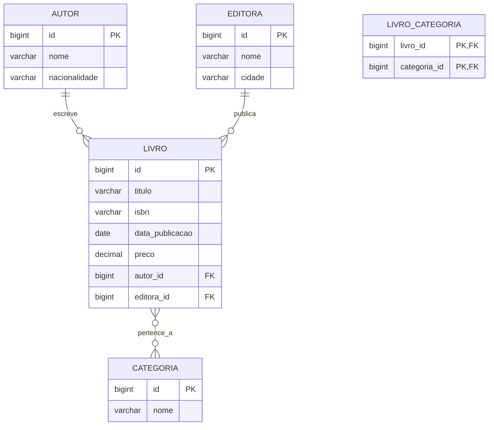

# 🚀 Hibernate 6 - Curso Prático Completo

<div align="center">


**Curso prático e completo de Hibernate 6 com Java, PostgreSQL e Maven**

[✨ Demonstração](#-demonstração) | [📚 Módulos](#-módulos-do-curso) | [🚀 Começando](#-começando) | [🤝 Contribuindo](#-contribuindo)

</div>

## 📖 Sobre o Projeto

Este repositório contém um curso prático e completo de **Hibernate 6**, baseado no livro "Introdução ao Hibernate 6". O curso foi projetado para desenvolvedores Java que desejam dominar o ORM mais popular do mundo, com exemplos reais, práticos e prontos para uso.

### 🎯 Objetivos do Curso

- ✅ **Aprender Hibernate 6 do zero ao avançado**
- ✅ **Dominar o mapeamento objeto-relacional (ORM)**
- ✅ **Implementar consultas eficientes com HQL e Criteria API**
- ✅ **Gerenciar transações e concorrência**
- ✅ **Otimizar performance em aplicações reais**
- ✅ **Integrar com PostgreSQL em ambientes de produção**

## 🛠️ Tecnologias Utilizadas

| Tecnologia | Versão | Finalidade |
|------------|--------|------------|
| **Java** | 17+ | Linguagem de programação principal |
| **Hibernate ORM** | 6.4.10 | Framework de mapeamento objeto-relacional |
| **PostgreSQL** | 15+ | Banco de dados relacional |
| **Maven** | 3.8+ | Gerenciamento de dependências |
| **JPA (Jakarta)** | 3.0+ | API de persistência padrão |
| **Log4j 2** | 2.22+ | Sistema de logging |

## 📋 Pré-requisitos

Antes de começar, certifique-se de ter instalado:

- ☕ **Java JDK 17 ou superior** ([Download](https://adoptium.net/))
- 🐘 **PostgreSQL 15 ou superior** ([Download](https://www.postgresql.org/download/))
- 🏗️ **Maven 3.8 ou superior** ([Download](https://maven.apache.org/download.cgi))
- 💻 **IDE de sua preferência** (IntelliJ IDEA, Eclipse, VS Code)
- 🐳 **Docker (opcional)** para PostgreSQL

## 🚀 Começando

### 1. Clonar o Repositório

```bash
git clone https://github.com/seu-usuario/hibernate6-curso-completo.git
cd hibernate6-curso-completo
```

### 2. Configurar o Banco de Dados

```sql
-- Conectar ao PostgreSQL
psql -U postgres

-- Criar banco de dados
CREATE DATABASE livraria;

-- Criar usuário (opcional)
CREATE USER hibernate_user WITH PASSWORD 'senhaSegura123';

-- Conceder privilégios
GRANT ALL PRIVILEGES ON DATABASE livraria TO hibernate_user;
```

### 3. Configurar as Propriedades

Edite o arquivo `src/main/resources/META-INF/persistence.xml`:

```xml
<property name="jakarta.persistence.jdbc.url" 
          value="jdbc:postgresql://localhost:5432/livraria"/>
<property name="jakarta.persistence.jdbc.user" value="postgres"/>
<property name="jakarta.persistence.jdbc.password" value="sua_senha"/>
```

### 4. Compilar e Executar

```bash
# Compilar o projeto
mvn clean compile

# Executar o exemplo principal
mvn exec:java -Dexec.mainClass="com.exemplo.Main"

# Executar testes
mvn test
```

## 📁 Estrutura do Projeto

```
hibernate6-curso-completo/
├── 📁 src/
│   ├── 📁 main/
│   │   ├── 📁 java/com/exemplo/
│   │   │   ├── 📁 model/          # Entidades JPA
│   │   │   │   ├── Livro.java
│   │   │   │   ├── Autor.java
│   │   │   │   └── heranca/       # Exemplos de herança
│   │   │   ├── 📁 service/        # Serviços e lógica de negócio
│   │   │   ├── 📁 repository/     # Repositórios (opcional)
│   │   │   └── Main.java          # Classe principal
│   │   └── 📁 resources/
│   │       ├── META-INF/
│   │       │   └── persistence.xml # Configuração do JPA
│   │       └── log4j2.properties  # Configuração de logs
│   └── 📁 test/                   # Testes unitários
├── 📁 scripts/                    # Scripts SQL e utilitários
├── 📁 docs/                       # Documentação adicional
├── pom.xml                        # Configuração Maven
├── README.md                      # Este arquivo
└── LICENSE                        # Licença do projeto
```

## 📚 Módulos do Curso

### 🎯 **Módulo 1: Configuração e Entidades Básicas**
- Configuração do Hibernate 6 com Maven
- Criação da primeira entidade `@Entity`
- Mapeamento básico com `@Column`, `@Id`, `@GeneratedValue`
- Configuração do PostgreSQL

### 🔗 **Módulo 2: Relacionamentos**
- `@OneToMany` e `@ManyToOne`
- `@OneToOne` com chave primária compartilhada
- `@ManyToMany` com tabela de junção
- Cascade types e fetch strategies

### 🔍 **Módulo 3: Consultas e Criteria API**
- HQL (Hibernate Query Language)
- Criteria API tipada
- Consultas nativas SQL
- Paginação e ordenação

### ⚡ **Módulo 4: Performance e Otimização**
- Solução do problema N+1
- Batch processing
- Cache de primeiro e segundo nível
- Estatísticas e monitoring

### 🔒 **Módulo 5: Transações e Concorrência**
- Gerenciamento de transações JTA e RESOURCE_LOCAL
- Locking otimista e pessimista
- Controle de concorrência com `@Version`
- Isolation levels

### 🏗️ **Módulo 6: Recursos Avançados**
- Herança (SINGLE_TABLE, JOINED, TABLE_PER_CLASS)
- Tipos incorporáveis (`@Embeddable`)
- Conversores customizados (`AttributeConverter`)
- Listeners e interceptors

## 💡 Exemplos de Código

### Exemplo 1: Entidade Básica

```java
@Entity
@Table(name = "livros")
public class Livro {
    @Id
    @GeneratedValue(strategy = GenerationType.IDENTITY)
    private Long id;
    
    @Column(nullable = false, length = 200)
    private String titulo;
    
    @Column(unique = true, nullable = false, length = 13)
    private String isbn;
    
    // Getters, setters e construtores
}
```

### Exemplo 2: Consulta com HQL

```java
public List<Livro> buscarPorTitulo(String palavraChave) {
    return em.createQuery(
        "SELECT l FROM Livro l WHERE LOWER(l.titulo) LIKE LOWER(:palavra)", 
        Livro.class)
        .setParameter("palavra", "%" + palavraChave + "%")
        .getResultList();
}
```

### Exemplo 3: Relacionamento Bidirecional

```java
@Entity
public class Autor {
    @OneToMany(mappedBy = "autor", cascade = CascadeType.ALL)
    private List<Livro> livros = new ArrayList<>();
    
    public void adicionarLivro(Livro livro) {
        livros.add(livro);
        livro.setAutor(this);
    }
}

@Entity
public class Livro {
    @ManyToOne(fetch = FetchType.LAZY)
    @JoinColumn(name = "autor_id")
    private Autor autor;
}
```

## 🧪 Testando o Projeto

```bash
# Executar todos os testes
mvn test

# Executar teste específico
mvn test -Dtest=LivroServiceTest

# Gerar relatório de cobertura (com Jacoco)
mvn clean test jacoco:report
```

## 🐳 Executando com Docker

```yaml
# docker-compose.yml
version: '3.8'
services:
  postgres:
    image: postgres:15
    environment:
      POSTGRES_DB: livraria
      POSTGRES_USER: postgres
      POSTGRES_PASSWORD: senha123
    ports:
      - "5432:5432"
    volumes:
      - postgres_data:/var/lib/postgresql/data

volumes:
  postgres_data:
```

```bash
# Iniciar o PostgreSQL com Docker
docker-compose up -d

# Parar os containers
docker-compose down
```

## 📊 Diagrama do Banco de Dados



## 🤝 Contribuindo

Contribuições são bem-vindas! Siga estes passos:

1. **Fork** o projeto
2. **Crie uma branch** para sua feature (`git checkout -b feature/AmazingFeature`)
3. **Commit** suas mudanças (`git commit -m 'Add some AmazingFeature'`)
4. **Push** para a branch (`git push origin feature/AmazingFeature`)
5. **Abra um Pull Request**

### 📝 Padrões de Commit

| Tipo | Descrição |
|------|-----------|
| `feat` | Nova funcionalidade |
| `fix` | Correção de bug |
| `docs` | Documentação |
| `style` | Formatação, pontuação, etc |
| `refactor` | Refatoração de código |
| `test` | Adicionar ou corrigir testes |
| `chore` | Atualização de tarefas de build, etc |

## 📄 Licença

Este projeto está licenciado sob a Licença MIT - veja o arquivo [LICENSE](LICENSE) para detalhes.

## 🙏 Agradecimentos

- **Equipe do Hibernate** pelo excelente framework
- **Gavin King** pela criação do Hibernate
- **Comunidade Java** pelo suporte contínuo
- **Livro "Introdução ao Hibernate 6"** que serviu de base para este curso

## 📚 Recursos Adicionais

- [📖 Documentação Oficial do Hibernate 6](https://hibernate.org/orm/documentation/6.4/)
- [📚 Javadoc do Hibernate 6](https://docs.jboss.org/hibernate/orm/6.4/javadocs/)
- [🎓 Jakarta Persistence Specification](https://jakarta.ee/specifications/persistence/3.0/)
- [💬 Fórum da Comunidade Hibernate](https://discourse.hibernate.org/)
- [🐙 Código Fonte do Hibernate](https://github.com/hibernate/hibernate-orm)

## 📞 Suporte

Encontrou um problema ou tem dúvidas?

1. 📖 **Verifique a documentação** e exemplos
2. 🔍 **Procure por issues similares** no GitHub
3. 🐛 **Abra uma issue** com detalhes do problema
4. 💬 **Participe da discussão** na aba de issues

---

<div align="center">

### Desenvolvido com ❤️ para a comunidade Java

**⭐ Dê uma estrela no repositório se este projeto te ajudou!**

[Voltar ao topo](#-hibernate-6---curso-prático-completo)

</div>
